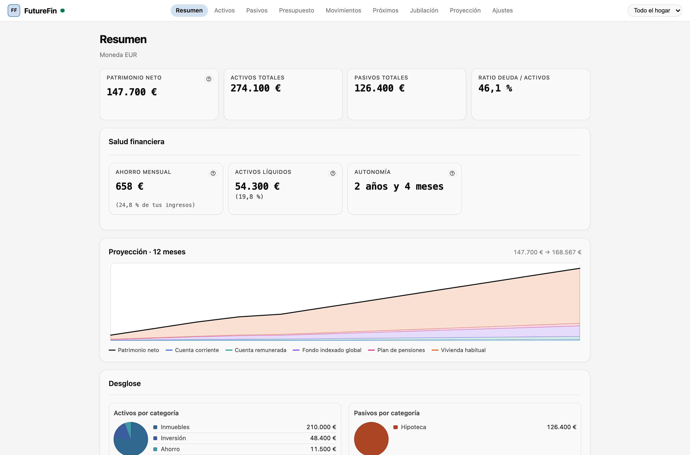
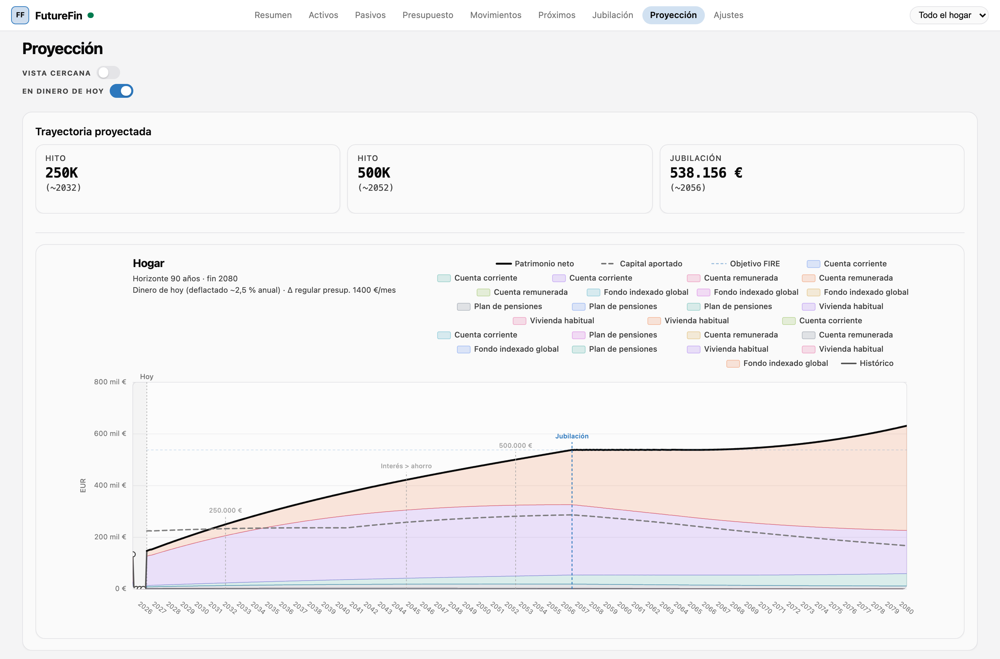
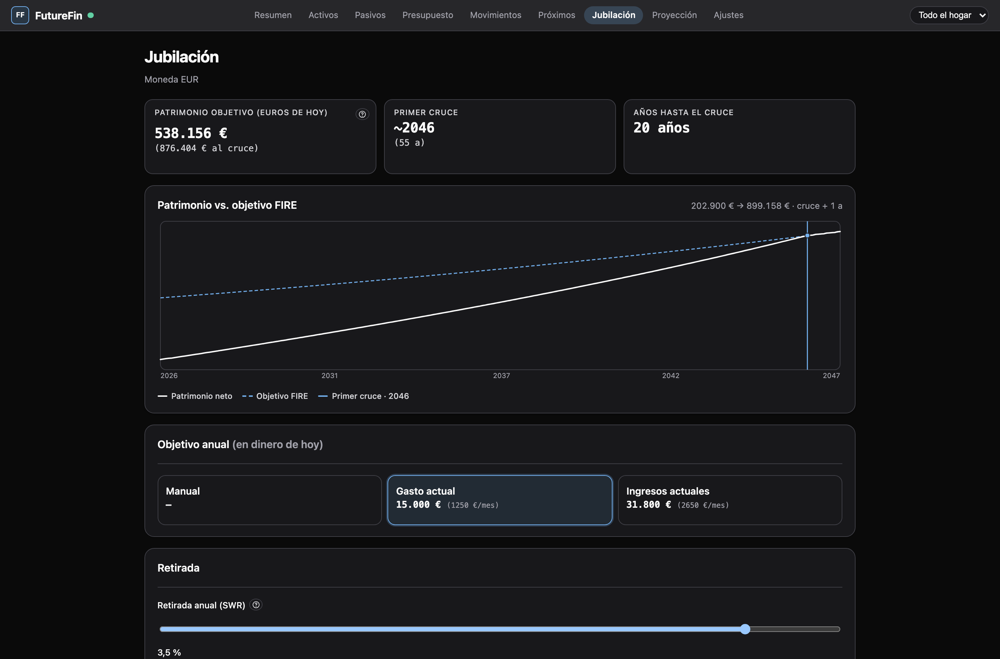
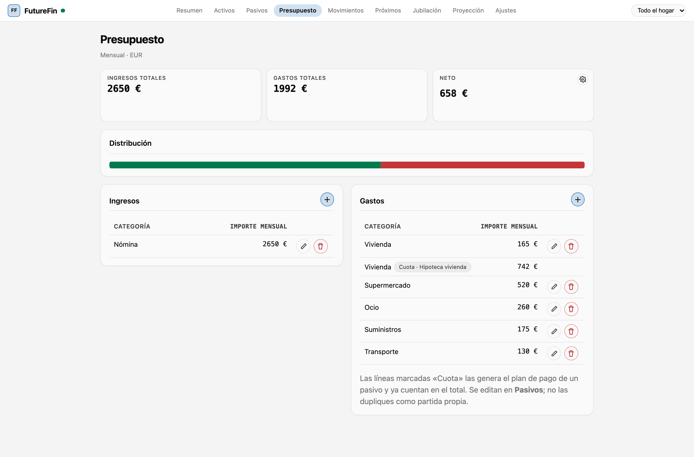
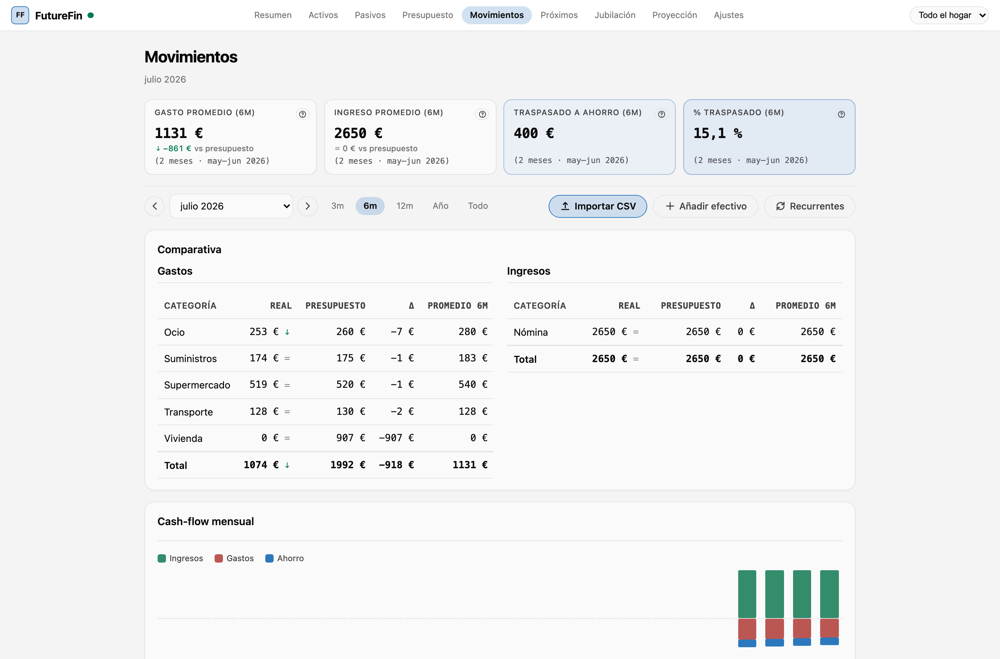

# FutureFin

**Tus finanzas de hoy y las de dentro de treinta años, en el mismo sitio.** Apunta lo que tienes y
lo que debes, cuadra tu presupuesto, importa los movimientos de tu banco y mira cuándo dejarías de
depender de tu sueldo. Todo en tu servidor, sin cuentas de terceros y sin que tus datos salgan de
casa.

[](LICENSE)
[](https://hub.docker.com/r/maxlainz/futurefin)
[](https://github.com/maxlainz/FutureFin/actions/workflows/ci.yml)



---

## Para quién es

Para quien lleva sus cuentas a mano en una hoja de cálculo y ya se le queda pequeña. Si te has
preguntado alguna vez **«¿cuánto tardaría en poder vivir de mis ahorros?»** y quieres una respuesta
que se actualice sola cuando cambien tus números, esto es para ti.

Se instala en un comando, corre en cualquier trasto que aguante Docker —un NAS, un mini PC, un VPS—
y no manda nada a ninguna parte.

## Qué hace

### Tu patrimonio, y a dónde va

Registra activos y deudas, y FutureFin proyecta tu patrimonio neto mes a mes: cada activo compone
su rentabilidad esperada, cada préstamo amortiza su cuadro real. La curva es lo que sale de tus
números, no una regla de tres.



### Cuándo llegas a tu objetivo

Dile cuánto quieres gastar al año cuando dejes de trabajar y con qué tasa de retirada, y verás en
qué año se cruzan tu patrimonio y tu objetivo. El objetivo **crece con la inflación** que configures
—no es lo mismo 30.000 € al año hoy que dentro de veinte— y, si quieres, descuenta el IRPF del
ahorro por tramos.



### Tu jubilación, a tu manera

El cruce de patrimonio y objetivo es una forma de jubilarse, no la única. Eliges **una de cinco
estrategias** y la simulación entera se adapta:

- **Cuanto antes (FIRE clásico)** — te vas el mes en que el capital llega.
- **A una edad fija** — te vas a los 55 pase lo que pase, y el plan te dice **cuánto tienes que
  ahorrar** para llegar y cuánto te sobra. Si no llegas, te lo dice en rojo en vez de dibujar una
  curva optimista.
- **Ahorrar ahora y dejar crecer (Coast FIRE)** — el mes a partir del cual puedes dejar de aportar.
- **Media jornada** — una fase intermedia con menos ingreso, cubriendo el hueco con el capital.
- **Puente hasta la pensión** — declaras tu pensión pública **con la edad a la que empieza**, y el
  objetivo deja de ser «capital para siempre» y pasa a ser «capital hasta que llegue, más lo que
  ella no cubra».

Y decides **cómo sale el dinero** una vez jubilado: gasto fijo indexado, un porcentaje del saldo,
una regla híbrida o una con bandas (Guyton-Klinger). Cada plan es de **cada persona**: en un hogar
compartido, cada cual tiene el suyo.

### Y si los mercados no se portan como la media

Declara la **volatilidad** de cada activo y FutureFin corre cientos de veces el mismo plan —el mismo
motor, tus mismos datos— sorteando cada mes: una **banda de escenarios** p10/p50/p90, la
**probabilidad de que la cartera aguante** el horizonte entero, y la de agotarse a cada edad.

Con los supuestos declarados en la propia respuesta, no en una nota al pie: el sorteo es
paramétrico y no un histórico, los meses son independientes, y con un shock común la diversificación
no se premia aquí. Un modelo estocástico sin sus supuestos a la vista es un generador de números que
parecen ciertos.

### Presupuesto, y qué haces con lo que sobra

Cuadra tus ingresos y gastos mensuales. Lo que sobra no se queda en el aire: defines reglas de
reparto —tanto fijo a esta cuenta, un porcentaje a este fondo, el resto aquí— con topes, y la
proyección las aplica cada mes.



### Lo que ha pasado de verdad

Importa los CSV de tu banco, varios a la vez si quieres (MyInvestor y N26 se reconocen solos), o apunta el efectivo a mano.
FutureFin detecta duplicados, aprende cómo categorizas y empareja las transferencias entre tus
propias cuentas para que no cuenten como gasto. Después compara mes real, presupuesto y promedio.



### Y además

- **Histórico**: guarda fotos de tu patrimonio y FutureFin reconstruye la curva del pasado, unida a
  la del futuro en un solo gráfico.
- **Hogar compartido**: varias personas, una instalación. Cada una trabaja en **lo suyo** y puede
  mirar el hogar entero en una vista agregada de solo lectura, con la línea de cada miembro sobre la
  suma. Editar la fila de otra persona no se puede, tampoco siendo el propietario. Quien es
  propietario aprueba a quien entra, y también puede cambiarle el rol o retirarle el acceso — sin
  borrar sus datos, que vuelven intactos si la readmite.
- **Copias de seguridad**: exporta tus datos en un archivo cifrado con tu contraseña, y el
  contenedor guarda un respaldo automático antes de cada actualización.
- **Claude**: si quieres, conecta la app a Claude y pregúntale por tus finanzas en voz alta, o
  déjale apuntar los gastos. Con permisos que controlas y que puedes revocar de golpe.

## Instalación

### Como add-on de Home Assistant

Si ya usas Home Assistant, es el camino corto: un panel más en la barra lateral, sin escribir
ningún `docker-compose.yml` y entrando con tu propio usuario de Home Assistant.

[](https://my.home-assistant.io/redirect/supervisor_add_addon_repository/?repository_url=https%3A%2F%2Fgithub.com%2Fmaxlainz%2FFutureFin)

Ese botón añade este repositorio a tu tienda de add-ons; después, **Instalar → Iniciar → Mostrar en
la barra lateral**. Todo lo demás —opciones, copias de seguridad, y por qué MCP necesita ahí un
puerto aparte— en [docs/home-assistant.md](docs/home-assistant.md).

### Con Docker Compose

Un solo contenedor: **PostgreSQL va dentro de la imagen**. No hace falta configurar nada.

Guarda esto como `docker-compose.yml`:

```yaml
name: futurefin

services:
  futurefin:
    image: maxlainz/futurefin:latest
    container_name: futurefin
    restart: unless-stopped
    # PostgreSQL vive dentro del contenedor: dale margen para cerrar bien.
    stop_grace_period: 60s
    ports:
      - "8080:8080"
    volumes:
      - pgdata:/var/lib/postgresql/data   # la base de datos
      - ffdata:/var/lib/futurefin         # backups automáticos
    healthcheck:
      test: ["CMD-SHELL", "curl -fsS http://127.0.0.1:8080/v1/ready >/dev/null"]
      interval: 15s
      timeout: 5s
      retries: 5
      start_period: 120s

volumes:
  pgdata:
  ffdata:
```

Y arranca:

```bash
docker compose up -d
```

Abre `http://localhost:8080` y **crea tu cuenta: la primera persona que se registra es la
propietaria del hogar**. Un asistente te preguntará la divisa, tu zona horaria y un par de
supuestos, y ya puedes empezar.

Si alguien más se registra, verá una pantalla de espera hasta que tú le des acceso desde
`Ajustes → Usuarios`.

> Sin un volumen montado en `/var/lib/postgresql/data` el contenedor **se niega a arrancar**. Es
> deliberado: sin él, tus datos morirían con el contenedor.

**¿Vienes de una versión anterior con base de datos externa?** Desde 4.0.0 PostgreSQL va siempre
dentro de la imagen. Si tienes `DATABASE_URL` apuntando fuera, arranca una vez FutureFin 3.9.0 para
migrar tus datos y después actualiza — el contenedor 4.x te lo dirá si te lo saltas, sin tocar nada.
Los pasos exactos en [docs/actualizar.md](docs/actualizar.md).

Más detalle en [docs/instalacion.md](docs/instalacion.md).

## Documentación

| | |
|---|---|
| [Instalación](docs/instalacion.md) | Poner en marcha la app, volúmenes, primer usuario, subpath |
| [Home Assistant](docs/home-assistant.md) | El add-on: panel, opciones, SSO, backups, MCP |
| [Actualizar](docs/actualizar.md) | Subir de versión, volver atrás, migrar desde 2.x |
| [Tu plan de jubilación](docs/jubilacion.md) | Las cinco estrategias, la pensión con fecha, las reglas de retirada y la sección «Riesgo» |
| [Configuración](docs/configuracion.md) | Variables de entorno y ajustes de la instalación |
| [Copias de seguridad](docs/backups.md) | Las tres capas de respaldo y cómo restaurar |
| [Conectar Claude](docs/mcp.md) | El servidor MCP, tokens y permisos |
| [Desarrollo](docs/desarrollo.md) | Entorno local, tests, construir la imagen |

## Privacidad

- **Autoalojado.** La app corre en tu máquina y habla con tu base de datos, que también está en tu
  máquina.
- **Sin telemetría.** No hay analítica, ni informes de errores remotos, ni «llamar a casa». La app
  no hace ni una sola petición a un servidor que no sea el tuyo.
- **Sin cuentas de terceros ni email.** Registrarse es un usuario y una contraseña; no se pide
  correo porque no hay nada que enviar.
- Las contraseñas se guardan con Argon2id y las copias `.ffbackup` van cifradas con la tuya.

FutureFin **no gestiona HTTPS**. Si la vas a exponer fuera de tu red, ponla detrás de un proxy
inverso con TLS. Ver [SECURITY.md](SECURITY.md).

## Aviso

FutureFin es una **herramienta de planificación**, no asesoramiento financiero. Sus proyecciones
son aritmética sobre los supuestos que tú introduces: rentabilidades esperadas, inflación, tasa de
retirada. El futuro no se comporta como una hoja de cálculo. Úsalo para entender el orden de
magnitud y la dirección, no para tomar decisiones irreversibles.

## Estado del proyecto

Se desarrolla activamente y se usa a diario en producción, pero por una sola persona y en un solo
hogar: es probable que tu caso toque algo que nadie ha probado. Los issues son bienvenidos.

- **Divisa**: se elige una por instalación (EUR, USD o GBP). No hay multidivisa ni conversión.
- **Idioma**: la interfaz está solo en español.

### Lo que se afirma aquí, y qué lo respalda

Todo lo de arriba es comprobable en el repositorio; estas tres son las que más fácil sería exagerar,
así que van con el test que las sostiene:

- **«El mismo sorteo da la misma cifra hoy y dentro de un año»** — la semilla de los escenarios se
  deriva de tu instalación y tu usuario, y la corrida es reproducible bit a bit:
  `mc_same_seed_bit_identical` (`crates/engine-stochastic/tests/monte_carlo.rs`).
- **«Es el mismo motor, evaluado muchas veces»** — sin volatilidad declarada, la banda **es** la
  línea de siempre: `mc_zero_volatility_degenerates_to_deterministic` (mismo fichero), y la
  equivalencia entre el camino exacto y el estocástico se comprueba mes a mes en todo el horizonte,
  para todos los escenarios de la batería, en `tests/degeneration.rs`.
- **«La jubilación por estrategias no cambió los números de nadie que ya usaba FutureFin»** — el
  motor está fijado a un fichero dorado que resume **todas** sus salidas caso por caso:
  `crates/engine/tests/fixtures/pins-4.15.json`, comprobado por
  `cargo test -p futurefin-engine --test golden_pins`. Si un solo dígito se moviera, el test falla y
  nombra el escenario.

Lo que **no** se afirma: que las probabilidades sean predicciones. Son aritmética sobre supuestos
que eliges tú — ver el [Aviso](#aviso) de arriba.

## Contribuir

Lee [CONTRIBUTING.md](CONTRIBUTING.md). Antes de abrir un issue con logs o capturas, comprueba que
no llevan datos financieros tuyos.

## Licencia

[AGPL-3.0](LICENSE). Puedes usarla, modificarla y autoalojarla libremente; si ofreces una versión
modificada como servicio a terceros, tienes que publicar tus cambios.
